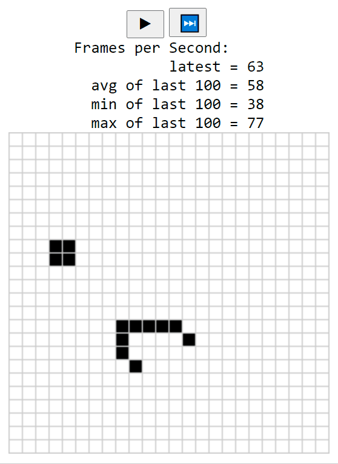

# Game of Life

Game of life simulation written in Rust and compiled to WebAssembly



## How to play

### 🛠️ Build

To build the project install wasm-pack and npm and run on the root of the repository:

```
wasm-pack build
```
 
Then you can build the web page by going into the `www` folder and running:

```
npm install
```

### 🏃‍♂️ Run

Inside the `www` folder run:

```
npm run start
```
